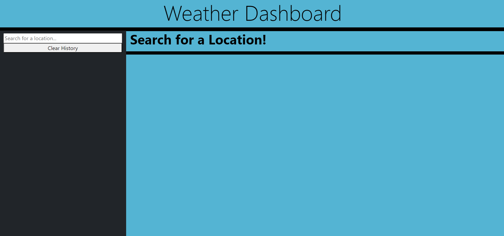
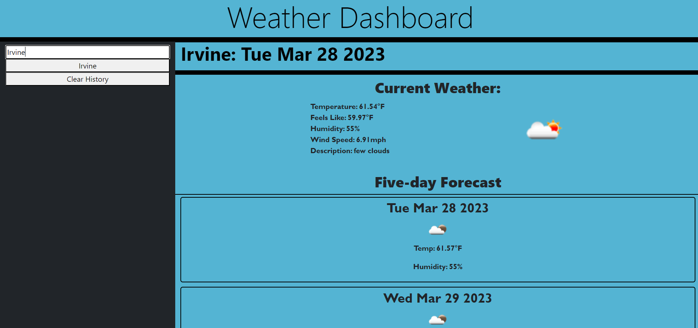
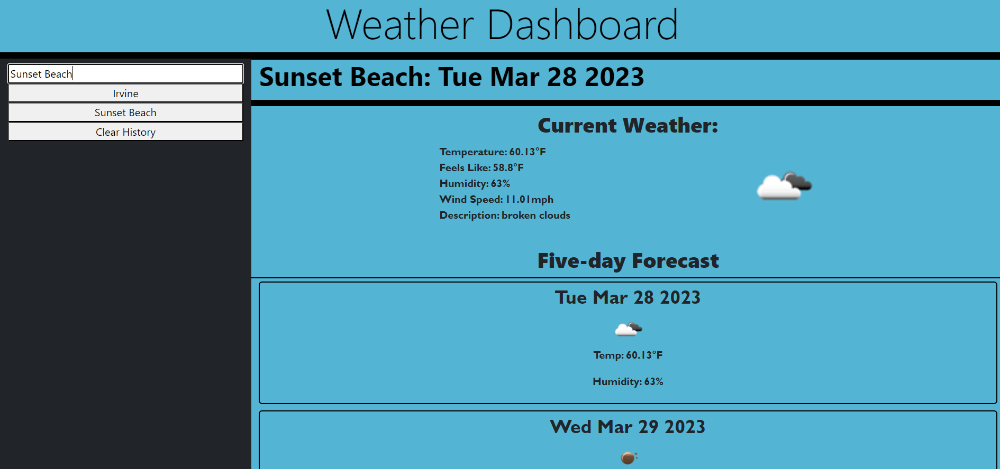

# Weather App

## Description
A simple app using the open weather API, it will return the current weather of a city you select along with a 5 day forecast. It will also save your last search to local storage so you can easily access it again.

## Screenshots
Weather App

## Installation
No installation required.

## License
MIT License

## URL
https://lsenn404.github.io/weather-app/

## Contact
You can reach me at Logsenn2@gmail.com
